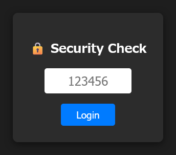

# ComfyUI-OTP-Auth

[🇯🇵 日本語](#日本語)

A lightweight TOTP authentication gate for ComfyUI. It can protect the whole ComfyUI web UI with codes from Google Authenticator, Microsoft Authenticator, 1Password, Authy, or another standard TOTP application.



## Features

- TOTP authentication.
- First-run QR setup.
- Signed, expiring session cookies.
- `HttpOnly`, `SameSite`, and configurable `Secure` cookie attributes.
- Login brute-force rate limiting.
- Localhost bypass and IP/CIDR whitelist options.
- Current ComfyUI route registration through `PromptServer.instance.routes`.
- No ComfyUI workflow nodes are added; this extension only protects the web server.

## Installation

Clone this repository into ComfyUI's `custom_nodes` directory and install the dependency:

```bash
pip install -r requirements.txt
```

Restart ComfyUI, open it in a browser, scan the QR code, and confirm the displayed 6-digit TOTP code.

## Configuration

`config.ini` is created automatically and is ignored by Git. Restart ComfyUI after changing settings manually.

```ini
[AUTH]
SECRET_KEY = <generated TOTP secret>
COOKIE_NAME = <generated cookie name>
SESSION_SECRET = <generated session-signing secret>

IS_SETUP_COMPLETED = True
SKIP_AUTH_ON_LOCALHOST = False
IP_WHITELIST =

SESSION_MAX_AGE_DAYS = 30
COOKIE_SECURE = Auto
COOKIE_SAMESITE = Strict
```

### Cookie security

`SESSION_SECRET` signs authentication cookies with HMAC-SHA256. A client cannot create a valid login cookie just by knowing the cookie name or the old literal value.

- `COOKIE_SECURE = Auto`: adds the Secure flag when aiohttp sees an HTTPS request.
- `COOKIE_SECURE = True`: always adds the Secure flag. Recommended when HTTPS terminates at a reverse proxy.
- `COOKIE_SECURE = False`: allows HTTP cookies. Use only on trusted local networks.
- `COOKIE_SAMESITE`: `Strict`, `Lax`, or `None`. Default is `Strict`.

Existing cookies from versions before 0.2.0 are intentionally invalid after this update. Log in once with TOTP again.

### Localhost / reverse proxy warning

`SKIP_AUTH_ON_LOCALHOST = True` trusts the network peer seen by ComfyUI. If Cloudflare Tunnel, nginx, Caddy, another reverse proxy, or a similar service runs on the same machine, a remote request may arrive at ComfyUI from `127.0.0.1`. In that architecture, **do not enable localhost bypass**.

The same caution applies to broad IP whitelist ranges. Keep the bypass disabled for internet-facing deployments unless you fully understand the proxy path.

## Reset / re-setup

For a full reset, stop ComfyUI, delete `config.ini`, and start ComfyUI again. A new TOTP secret, cookie name, and session-signing secret will be generated.

To keep the current TOTP secret but show setup again, stop ComfyUI, set:

```ini
IS_SETUP_COMPLETED = False
```

and restart it.

## Logout

A POST request to `/custom_auth/logout` clears the authentication cookie.

## Compatibility

Version 0.2.0 was tested with ComfyUI 0.37.0. ComfyUI changes over time, so testing against newer releases is recommended before exposing a server publicly.

---

<a name="日本語"></a>
# 日本語

ComfyUI 全体のWebアクセスに TOTP（ワンタイムパスワード）認証を追加する軽量なカスタム拡張です。Google Authenticator など標準的なTOTPアプリを利用できます。

## 主な機能

- TOTPによるログイン
- 初回起動時のQRコードセットアップ
- HMAC-SHA256署名付き・有効期限付きセッションCookie
- `HttpOnly` / `SameSite` / `Secure` Cookie設定
- ログイン失敗回数による簡易レート制限
- localhost認証スキップ
- IPアドレス/CIDRホワイトリスト
- 現行ComfyUIの `PromptServer.instance.routes` 形式でAPIを登録

## セキュリティ上の変更点

0.2.0以前はログイン済みCookieの値が固定文字列でした。0.2.0からはランダムな `SESSION_SECRET` を使ってCookieへ署名するため、Cookie名を知っているだけでは認証済みCookieを偽造できません。

アップデート前のCookieは無効になります。アップデート後、TOTPで一度ログインし直してください。

## localhost認証スキップの注意

同じPC上で Cloudflare Tunnel、nginx、Caddy などを動かしている場合、インターネットからのアクセスでもComfyUIからは接続元が `127.0.0.1` に見える場合があります。

その構成では:

```ini
SKIP_AUTH_ON_LOCALHOST = False
```

を推奨します。

## HTTPS / Secure Cookie

ComfyUIへ直接HTTPSで接続している場合は `COOKIE_SECURE = Auto` で自動判定できます。

リバースプロキシ側でHTTPSを終端し、ComfyUIとの間がHTTPの場合は次を推奨します。

```ini
COOKIE_SECURE = True
```

ブラウザへ返るCookieにSecure属性が付きます。

## 複数ユーザーについて

現在は「1つのComfyUIインスタンスに1つのTOTP秘密鍵」という単一ユーザー方式です。

複数人で使う場合は、公開セルフ登録ではなく、管理者がユーザーを追加して各ユーザーへ個別のTOTP秘密鍵を発行する方式が安全です。公開セルフ登録を有効にすると認証ゲートそのものを誰でも通過できる設計になり得るため、デフォルト機能にはしていません。
